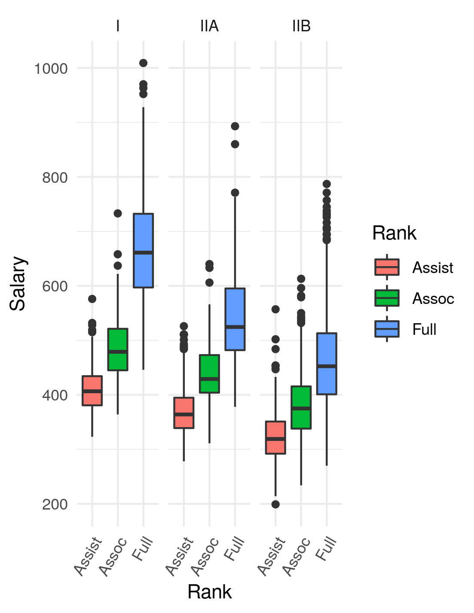

```{r setup, include=FALSE}
knitr::opts_chunk$set(echo = TRUE)
```

URL for the exam and data files: [https://github.com/gzahn/BIOL3100_Exams/tree/master/Exam_2](https://github.com/gzahn/BIOL3100_Exams/tree/master/Exam_2)

Do a fresh "git pull" to get the skills test files.
The files you just got from your "git pull" are:
  
  - Exam_3.Rmd
  - Exam_3.html
  - README.txt                    
  - FacultySalaries_1995.csv      
  - fig1.png                      

Create a new directory in YOUR data course repository called Exam_3               

Create a new Rproject in this new directory and copy all exam files to it  

Complete the tasks below in a markdown script called LASTNAME_Skills_Test_3.Rmd       

Be sure that your file paths are relative to your new Rproject             

**Note that I want a knitted html report that documents your code and comments/notes this time**

___

# Tasks:
  
**1. Load and clean FacultySalaries_1995.csv file and Re-create the graph below...**

```{r echo=FALSE, fig.align='center',fig.width=5,fig.height=5}

```


Please pay attention to what variables are on this graph.  This task is really all about whether you can make a tidy dataset out of something a bit wonky. Refer back to the video where we cleaned "Bird_Measurements.csv" if you need a refresher.

FacultySalaries_1995.csv contains college faculty salaries and total compensation from 1995, by Ranks, Tier, and State (This is supposedly real data, but I'm not sure the scale. 600 definitely doesn't mean $600,000, but it's not important.) 

College faculty have 3 ranks: Assistant (not tenured), Associate (tenured), and Full (been around forever or something). College "Tier" refers to the amount of funding devoted to research vs the amount of funding for teaching, with Tier I being universities that spend more on research than teaching and award PhD degrees.


```{r}
library(tidyverse)

sal<- read_csv("FacultySalaries_1995.csv")
view(sal)

sal_filter <- sal %>%
  filter(Tier != "VIIB")

sal_clean <- sal_filter %>%
  pivot_longer(
    cols = c(AvgFullProfSalary, AvgAssocProfSalary, AvgAssistProfSalary),
    names_to = "Rank",
    values_to = "Salary"
  ) %>%
  mutate(
    Rank = case_when(
      Rank == "AvgFullProfSalary" ~ "Full",
      Rank == "AvgAssocProfSalary" ~ "Associate",
      Rank == "AvgAssistProfSalary" ~ "Assistant"
    ),
    Salary = as.numeric(Salary)
  )

view(sal_clean)


sal_clean %>%
  ggplot(aes(x = Rank, y = Salary, fill = Tier)) +
  geom_boxplot() +
  theme_minimal() +
  facet_wrap(~Tier)+
  labs(
    title = "Salary Distribution by Rank and Tier",
    x = "Faculty Rank",
    y = "Average Salary (1995)"
  )

```


**2. Build an ANOVA model and display the summary output in your report.**

The ANOVA model should test the influence of "State", "Tier", and "Rank" on "Salary" but should NOT include any interactions between those predictors.

```{r}
anova_sal <- aov(Salary ~ State + Tier + Rank, data = sal_clean)
summary(anova_sal)
```

**3. The rest of the test uses another data set. The "Juniper_Oils.csv" data. Get it loaded and take a look. Then tidy it! (show the code used for tidying in your report)**
        
It's not exactly tidy either. Get used to that. It's real data collected as part of a collaboration between Young Living Inc. and UVU Microbiology. A number of dead cedar trees were collected and the chemical composition of their essential oil content was measured. The hypothesis was that certain chemicals would degrade over time since they died in fires. So there are a bunch of columns for chemical compounds, and a column for "YearsSinceBurn." The values under each chemical are Mass-Spec concentrations.
        Those are the ones the columns we care about for the purposes of this exam. Guess what, I'm giving you a nicely formatted list of the chemical compounds:

        c("alpha-pinene","para-cymene","alpha-terpineol","cedr-9-ene","alpha-cedrene","beta-cedrene","cis-thujopsene","alpha-himachalene","beta-chamigrene","cuparene","compound 1","alpha-chamigrene","widdrol","cedrol","beta-acorenol","alpha-acorenol","gamma-eudesmol","beta-eudesmol","alpha-eudesmol","cedr-8-en-13-ol","cedr-8-en-15-ol","compound 2","thujopsenal")
 
 
```{r}

# Load the dataset
jun<- read_csv("Juniper_Oils.csv")
View(jun)
# Tidy the dataset: Convert chemical columns to a long format
jun_clean <- jun %>%
  pivot_longer(
    cols = `alpha-pinene`:`thujopsenal`, # Adjust to include all chemical columns
    names_to = "Chemical",
    values_to = "Concentration"
  )

View(jun_clean)
```
                                               
**4. Make me a graph of the following:**

        x = YearsSinceBurn
        y = Concentration
        facet = ChemicalID (use free y-axis scales)
        
See the figure below for an idea of what I'm looking for:

```{r echo=FALSE, fig.align='center',fig.width=5,fig.height=5}
knitr::include_graphics("./Fig2.png")
```


```{r}
jun_clean %>%
  ggplot(aes(x = YearsSinceBurn, y = Concentration)) +
  geom_point() +
  geom_smooth(method = "glm") + 
  theme_minimal() +
  facet_wrap(~Chemical, scales = "free_y")+
  labs(
    title = "Concentration of Selected Chemicals Over Time",
    x = "Years Since Burn",
    y = "Chemical Concentration"
  )
```

**5. Use a generalized linear model to find which chemicals show concentrations that are significantly (significant, as in P < 0.05) affected by "Years Since Burn".**

Use the tidy() function from the broom R package in order to produce a data frame showing JUST the significant chemicals and their model output (coefficient estimates, p-values, etc)     

I'll show you what I mean...here's the sort of data frame I need you to produce from your glm model (just the significant model terms from a much larger model output):

      # A tibble: 6 x 5
        term                          estimate std.error statistic  p.value
        <chr>                            <dbl>     <dbl>     <dbl>    <dbl>
      1 alpha-cedrene                    7.88      1.93       4.08 4.97e- 5
      2 cedr-8-en-13-ol                  7.62      1.93       3.95 8.72e- 5
      3 cedrol                          22.5       1.93      11.7  5.12e-29
      4 cis-thujopsene                  17.3       1.93       8.95 2.93e-18
      5 widdrol                          5.82      1.93       3.01 2.69e- 3
      6 cis-thujopsene:YearsSinceBurn    0.332     0.141      2.35 1.90e- 2

```{r}
library(broom)

glm_jun <- jun_clean %>%
  group_by(Chemical) %>%                  
  nest() %>%                              
  mutate(
    glm_model = map(data, ~ glm(Concentration ~ YearsSinceBurn, data = .x, family = gaussian())),
    glm_summary = map(glm_model, tidy)
  ) %>%
  unnest(glm_summary) %>%                 
  filter(term == "YearsSinceBurn" | str_detect(term, ":")) %>%  
  
  
  select(Chemical, term, estimate, std.error, statistic, p.value) %>% 
  arrange(p.value)                      

print(glm_jun)


jun_sig <- glm_jun %>%
  filter(p.value < 0.1) %>%
  arrange(p.value)            

print(jun_sig)


```

**6. Commit and push all your code and files to GitHub. I'll pull your repository and grade what I find in your html report.**

___

None of the tasks here should be too difficult. You've done them before. So take a bit of care to produce a report that looks clean. Please include the code used to produce plots or models, etc. In the future, feel free to hide your code to make your reports for other projects look cleaner, but since we're learning R in this course, I still mostly want to see your code where applicable. In other words, don't use 'echo=FALSE' in every code chunk.
                                                                                                              
                                                                                                    
